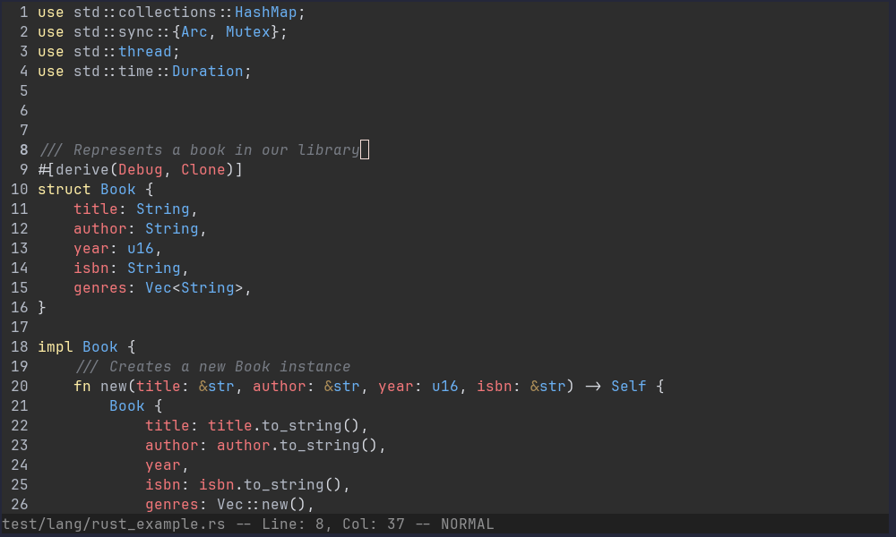

# 🌊 Tide - A Terminal Editor in Go

[](https://goreportcard.com/report/github.com/bethropolis/tide)
[](https://github.com/bethropolis/tide/releases/latest)
[](https://github.com/bethropolis/tide/blob/main/LICENSE)
[](https://github.com/bethropolis/tide/actions/workflows/go.yml) <!-- Add after setting up CI -->
[](https://golang.org/doc/go1.21)
[](https://github.com/bethropolis/tide/stargazers)
[](https://github.com/bethropolis/tide/issues)
[](https://codecov.io/gh/bethropolis/tide) <!-- Add after setting up Codecov -->

Tide is a modern, extensible terminal-based text editor written purely in Go. It features efficient syntax highlighting powered by Tree-sitter and is built with a focus on clean, modular code for stability and future growth.


<div align="center">
    
</div>


---

## ✨ Features

*   🚀 **Fast, Async Syntax Highlighting:** Uses Tree-sitter for accurate, performant highlighting that updates dynamically via debounced, incremental parsing.
*   🎨 **Theming Engine:**
    *   Load custom themes from TOML files in `~/.config/tide/themes/`.
    *   Set the active theme via `~/.config/tide/theme.toml`.
    *   Live theme switching with the `:theme <name>` command.
    *   Supports True Color hex codes (`#RRGGBB`).
    *   Includes a comfortable built-in default dark theme ("Dark comfort").
*   🌐 **Multi-Language Support:** Built-in support for Go, Python, JavaScript, JSON, and Rust. Easily extensible for more languages.
*   ✏️ **Core Editing:**
    *   Modal editing (Normal, Command, Find modes).
    *   Text insertion, deletion, line handling.
    *   Undo/Redo stack.
    *   Yank (Copy) / Paste (Internal register or optional System Clipboard).
    *   Find (`/`, `n`, `N`) with match highlighting.
    *   Replace (`:s/pattern/replacement/[g]` on current line).
    *   Auto Indentation.
    *   Line numbering.
    *   Configurable tab width rendering.
*   ⚙️ **Configuration:**
    *   Load settings (editor, logger) from `~/.config/tide/config.toml`.
    *   Command-line flag overrides for key settings.
    *   Advanced, filterable logging system (`slog` based).
*   🧩 **Modular & Extensible:** Clean architecture with a basic plugin system (example: Word Count).

---

## 🚀 Getting Started

### Installation

Ensure you have **Go 1.21+** installed.

```bash
# Install latest release
go install github.com/bethropolis/tide/cli/tide@latest

# Or, build from source:
# git clone https://github.com/bethropolis/tide.git
# cd tide
# go build ./cmd/tide/
# ./tide --help # See available flags
```

> Make sure `$GOPATH/bin` (usually `~/go/bin`) is in your system's `$PATH`.
 
### Basic Usage

```bash
# Open a file
tide path/to/your/file.go

# Start with an empty buffer
tide

# Use flags to override config (see details below)
tide --loglevel debug --config config.toml main.rs
```

---

## 🔧 Configuration

Tide uses TOML files located in `~/.config/tide/`.

<details>
  <summary><strong>1. Main Configuration (`config.toml`)</strong></summary>

  > Controls editor behavior and logger settings.
  > Placed at `~/.config/tide/config.toml`.

  ```toml
  # Example config.toml

  [logger]
  log_level = "info"           # "debug", "info", "warn", "error"
  log_file_path = "tide.log"   # Path relative to CWD, absolute path, "" for default (~/.config/tide/tide.log), or "-" for stderr
  # Filtering (optional - see logger docs/code for more):
  # enabled_tags = ["core", "find"]
  disabled_tags = ["theme", "highlight", "event"] # Hide noisy logs
  # enabled_packages = ["app", "core"]
  # disabled_packages = ["buffer"]

  [editor]
  tab_width = 4
  scroll_off = 3
  system_clipboard = false # Set true to use system clipboard
  # status_bar_height = 1 # Currently fixed at 1
  ```
</details>

<details>
  <summary><strong>2. Active Theme (`theme.toml`)</strong></summary>

  > Defines the currently active theme.
  > Placed at `~/.config/tide/theme.toml`.
  > This file is **overwritten** when you use the `:theme <name>` command.
  > If missing, the default built-in theme is saved here on first run.
</details>

<details>
  <summary><strong>3. Theme Files (`themes/*.toml`)</strong></summary>

  > Place custom `.toml` theme files in `~/.config/tide/themes/`.
  > Tide scans this directory for available themes to be used with the `:theme` command.

  *Example Theme File (`mytheme.toml`):*
  ```toml
  name = "My Custom Theme"
  is_dark = true

  [styles]
    Default = { fg = "#CDD6F4", bg = "#1E1E2E" } # Base background/foreground
    LineNumber = { fg = "#494D64", bg = "#1E1E2E" }
    StatusBar = { fg = "#CDD6F4", bg = "#181825" }
    StatusBarModified = { fg = "#F9E2AF" } # Inherits StatusBar BG
    Selection = { reverse = true }
    SearchHighlight = { fg = "#1E1E2E", bg = "#F9E2AF" }

    keyword = { fg = "#CBA6F7", bold = true }
    string = { fg = "#A6E3A1" }
    comment = { fg = "#6C7086", italic = true }
    # ... etc ...
  ```
</details>

<details>
  <summary><strong>4. Command-Line Flags</strong></summary>

  > Flags override settings from `config.toml`. Run `tide --help` for a full list.

  *   `-config <path>`: Specify config file path.
  *   `-loglevel <level>`: Set log level (`debug`, `info`, `warn`, `error`).
  *   `-logfile <path>`: Set log file path (`-` for stderr).
  *   `-tabwidth <num>`: Set tab width.
  *   `-scrolloff <num>`: Set scroll-off lines.
  *   `-system-clipboard`: Use system clipboard (sets to `true`).
  *   `-debug-log`: Enable verbose logging for the logger's filtering system.
  *   `-[log-*]` flags: Control detailed logger filtering (e.g., `-log-disable-packages=theme,buffer`).
</details>

---

## ⌨️ Keybindings (Default - Normal Mode)

<details>
  <summary>Show Default Keybindings</summary>

  | Key(s)                | Action                   | Description                                  |
  | :-------------------- | :----------------------- | :------------------------------------------- |
  | `Up`                  | Move Up                  | Move cursor up one line                      |
  | `Down`                | Move Down                | Move cursor down one line                    |
  | `Left`                | Move Left                | Move cursor left one column/rune             |
  | `Right`               | Move Right               | Move cursor right one column/rune            |
  | `PageUp`              | Page Up                  | Move viewport and cursor up one page         |
  | `PageDown`            | Page Down                | Move viewport and cursor down one page       |
  | `Home`                | Home                     | Move cursor to beginning of line             |
  | `End`                 | End                      | Move cursor to end of line                   |
  | `TAB`                 | Insert Tab               | Insert a tab character                       |
  | `Backspace`           | Delete Backward          | Delete character before cursor               |
  | `Delete`              | Delete Forward           | Delete character under/after cursor          |
  | `ESC`, `Ctrl+C`       | Quit / Clear Highlights  | Quit if unmodified, else prompt/clear search |
  | `Ctrl+Q`              | Force Quit               | Quit unconditionally                         |
  | `Ctrl+S`              | Save                     | Save the current buffer                      |
  | `Ctrl+Z`              | Undo                     | Undo the last change                         |
  | `Ctrl+R`, `<leader>r` | Redo                     | Redo the last undone change                  |
  | `Ctrl+X`, `<leader>x` | Yank (Copy)              | Copy selection to clipboard                  |
  | `Ctrl+V`, `<leader>p` | Paste                    | Paste from clipboard                         |
  | `<leader>/`           | Enter Find Mode          | Start searching                              |
  | `<leader>:`           | Enter Command Mode       | Start entering a command                     |
  | `<leader>n`           | Find Next                | Find next search match                       |
  | `<leader>N`           | Find Previous            | Find previous search match                   |
  | `<leader>w`           | Save                     | Alias for save                               |
  | `<leader>q`           | Quit                     | Alias for quit                               |


  *(Note: `<leader>` defaults to `,`. Timeout is 500ms)*
</details>

---

## 📜 Commands (in Command Mode `:`)

<details>
  <summary>Show Commands</summary>

  *   `:q` - Quit if buffer is unmodified. Shows warning if modified.
  *   `:wq` - Write buffer then quit. Fails if write fails.
  *   `:q!` - Force quit, discarding any unsaved changes.
  *   `:theme <theme_name>` - Switch to the specified theme (case-insensitive). Theme must exist in the themes directory or be built-in. Overwrites `~/.config/tide/theme.toml`.
  *   `:themes` - List available theme names in the status bar.
  *   `:s/pattern/replacement/[g]` - Replace first (`g` omitted) or all (`g` included) occurrences of `pattern` with `replacement` on the *current line*.
  *   `:w [filename]` - Write buffer to current file or `[filename]`.
  *   `:wc` - (From WordCount plugin) Display line, word, and byte count.
</details>

---

## 🚧 Known Limitations / Future Plans

*   **Terminal Mouse Selection:** Native terminal selection includes line numbers. Use internal Yank/Paste (`Ctrl+X`/`Ctrl+V`) for code. Full mouse support is planned.
*   **Undo for Global Replace/Complex Ops:** Undo works for single changes but not yet reliably for global replaces or potentially some plugin actions.
*   **Limited Replace Scope:** `:s` only operates on the current line. Range support (`:%s`, `:'<,'>s`) is planned.
*   **Basic Modes:** Primarily Normal mode exists. no Insert/Visual modes are planned.
*   **Performance:** Untested on very large files (> 100MB).
*   **Configuration:** Limited configuration options currently. More planned (keybindings, etc.).
*   **Status Bar Styling:** Segments like `[Modified]` aren't individually styled yet.

---

## 🤝 Contributing

Contributions are welcome! Please open an issue or submit a pull request.

## 📜 License

This project is licensed under the MIT License - see the [LICENSE](LICENSE) file for details.
