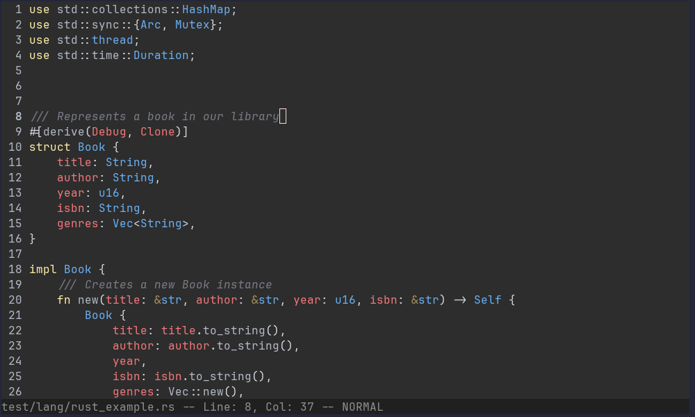

# 🌊 Tide - A Terminal Editor in Go

[](https://goreportcard.com/report/github.com/bethropolis/tide)
[](https://github.com/bethropolis/tide/releases/latest)
[](https://github.com/bethropolis/tide/blob/main/LICENSE)
[](https://github.com/bethropolis/tide/actions/workflows/release.yml)
[](https://golang.org/doc/go1.21)
[](https://github.com/bethropolis/tide/stargazers)
[](https://github.com/bethropolis/tide/issues)

Tide is a modern, extensible terminal-based text editor written purely in Go. It features efficient syntax highlighting powered by Tree-sitter and is built with a focus on clean, modular code for stability and future growth.


<div align="center">
    
</div>


---

## Features

*   **Fast, Async Syntax Highlighting:** Uses Tree-sitter for accurate, performant highlighting that updates dynamically via debounced, incremental parsing.
*   **Theming Engine:**
    *   Load custom themes from TOML files in `~/.config/tide/themes/`.
    *   Set the active theme via `~/.config/tide/theme.toml`.
    *   Live theme switching with the `:theme <name>` command.
    *   Supports True Color hex codes (`#RRGGBB`).
    *   Includes a comfortable built-in default dark theme ("Dark comfort").
*   **Multi-Language Support:** Built-in support for Go, Python, JavaScript, JSON, and Rust. Easily extensible for more languages.
*   **Core Editing:**
    *   Modal editing (Normal, Insert, Visual, Visual Line, Visual Block, Command, Find modes).
    *   Count prefixes (`3j`, `5dd`, `10l`).
    *   Dot repeat (`.` replays last insert changes).
    *   Text insertion, deletion, word deletion (`dw`, `db`), line joining (`J`).
    *   Undo/Redo stack with atomic transaction support.
    *   Yank (Copy) / Paste (Internal register or optional System Clipboard).
    *   Find (`/`, `n`, `N`, `*`, `#`) with match highlighting.
    *   Replace (`:s/pattern/replacement/[gi]`, `:%s/...`, `:'<,'>s/...`) with case-insensitive flag.
    *   File navigation (`gg`, `G`).
    *   Visual modes: character-wise (`v`), line-wise (`V`), block-wise (`Ctrl+V`).
    *   Auto Indentation.
    *   Line numbering.
    *   Configurable tab width rendering.
*   **Configuration:**
    *   Load settings (editor, logger) from `~/.config/tide/config.toml`.
    *   Dynamic TOML keybindings under `[keybindings]`.
    *   Command-line flag overrides for key settings.
    *   Advanced, filterable logging system (`slog` based).
*   **Plugin System:**
    *   Go plugins (e.g., Word Count, Auto Save, File Picker).
    *   Lua scripting with full API (`tide.*` functions, event subscriptions).
    *   Reusable UI Picker overlay.
    *   Tree-sitter local-symbol autocomplete in insert mode.

---

## Getting Started

### Installation

Ensure you have **Go 1.21+** installed.

**Option 1: Install with `just` (recommended)**

```bash
git clone https://github.com/bethropolis/tide.git
cd tide
just install          # builds and installs to ~/.local/bin
```

**Option 2: `go install`**

```bash
go install github.com/bethropolis/tide/cmd/tide@latest
```

**Option 3: Build from source**

```bash
git clone https://github.com/bethropolis/tide.git
cd tide
just build            # or: go build -o ./bin/tide ./cmd/tide
./bin/tide --help
```

> Make sure `$GOPATH/bin` (usually `~/go/bin`) or `~/.local/bin` is in your system's `$PATH`.

### Basic Usage

```bash
# Open a file
tide path/to/your/file.go

# Start with an empty buffer
tide

# Use flags to override config (see details below)
tide --loglevel debug --config config.toml main.rs
```

---

## Configuration

Tide uses TOML files located in `~/.config/tide/`.

<details>
  <summary><strong>1. Main Configuration (`config.toml`)</strong></summary>

  > Controls editor behavior and logger settings.
  > Placed at `~/.config/tide/config.toml`.

  ```toml
  # Example config.toml

  [logger]
  log_level = "info"           # "debug", "info", "warn", "error"
  log_file_path = "tide.log"   # Path relative to CWD, absolute path, "" for default (~/.config/tide/tide.log), or "-" for stderr
  # Filtering (optional - see logger docs/code for more):
  # enabled_tags = ["core", "find"]
  disabled_tags = ["theme", "highlight", "event"] # Hide noisy logs
  # enabled_packages = ["app", "core"]
  # disabled_packages = ["buffer"]

  [editor]
  tab_width = 4
  scroll_off = 3
  system_clipboard = false # Set true to use system clipboard
  # status_bar_height = 1 # Currently fixed at 1

  # Keybindings (optional)
  # Each section defines mode-specific key overrides.
  # Keys: "ctrl+s", "alt+x", "escape", "enter", etc.
  # Actions: see available action names below.
  [keybindings.normal]
  "ctrl+s" = "save"
  "ctrl+q" = "quit"

  [keybindings.insert]
  "escape" = "enter_normal"
  ```
</details>

<details>
  <summary><strong>2. Active Theme (`theme.toml`)</strong></summary>

  > Defines the currently active theme.
  > Placed at `~/.config/tide/theme.toml`.
  > This file is **overwritten** when you use the `:theme <name>` command.
  > If missing, the default built-in theme is saved here on first run.
</details>

<details>
  <summary><strong>3. Theme Files (`themes/*.toml`)</strong></summary>

  > Place custom `.toml` theme files in `~/.config/tide/themes/`.
  > Tide scans this directory for available themes to be used with the `:theme` command.

  *Example Theme File (`mytheme.toml`):*
  ```toml
  name = "My Custom Theme"
  is_dark = true

  [styles]
    Default = { fg = "#CDD6F4", bg = "#1E1E2E" } # Base background/foreground
    LineNumber = { fg = "#494D64", bg = "#1E1E2E" }
    StatusBar = { fg = "#CDD6F4", bg = "#181825" }
    StatusBarModified = { fg = "#F9E2AF" } # Inherits StatusBar BG
    Selection = { reverse = true }
    SearchHighlight = { fg = "#1E1E2E", bg = "#F9E2AF" }

    keyword = { fg = "#CBA6F7", bold = true }
    string = { fg = "#A6E3A1" }
    comment = { fg = "#6C7086", italic = true }
    # ... etc ...
  ```
</details>

<details>
  <summary><strong>4. Command-Line Flags</strong></summary>

  > Flags override settings from `config.toml`. Run `tide --help` for a full list.

  *   `-config <path>`: Specify config file path.
  *   `-loglevel <level>`: Set log level (`debug`, `info`, `warn`, `error`).
  *   `-logfile <path>`: Set log file path (`-` for stderr).
  *   `-tabwidth <num>`: Set tab width.
  *   `-scrolloff <num>`: Set scroll-off lines.
  *   `-system-clipboard`: Use system clipboard (sets to `true`).
  *   `-debug-log`: Enable verbose logging for the logger's filtering system.
  *   `-[log-*]` flags: Control detailed logger filtering (e.g., `-log-disable-packages=theme,buffer`).
</details>

---

## Keybindings (Default - Normal Mode)

<details>
  <summary>Show Default Keybindings</summary>

  | Key(s)                | Action                   | Description                                  |
  | :-------------------- | :----------------------- | :------------------------------------------- |
  | `Up`                  | Move Up                  | Move cursor up one line                      |
  | `Down`                | Move Down                | Move cursor down one line                    |
  | `Left`                | Move Left                | Move cursor left one column/rune             |
  | `Right`               | Move Right               | Move cursor right one column/rune            |
  | `PageUp`              | Page Up                  | Move viewport and cursor up one page         |
  | `PageDown`            | Page Down                | Move viewport and cursor down one page       |
  | `Home`                | Home                     | Move cursor to beginning of line             |
  | `End`                 | End                      | Move cursor to end of line                   |
  | `gg`                  | Go to File Start         | Move cursor to first line                    |
  | `G`                   | Go to File End           | Move cursor to last line                     |
  | `w`                   | Word Forward             | Move to start of next word                   |
  | `b`                   | Word Backward            | Move to start of current/previous word       |
  | `e`                   | Word End                 | Move to end of current/next word             |
  | `0`                   | Hard Home                | Move to column 0                             |
  | `i`                   | Insert Mode              | Enter insert mode at cursor                  |
  | `a`                   | Append Mode              | Enter insert mode after cursor               |
  | `A`                   | Append End               | Enter insert mode at end of line             |
  | `I`                   | Insert Start             | Enter insert mode at first non-blank         |
  | `o`                   | Open Below               | Insert line below, enter insert mode         |
  | `O`                   | Open Above               | Insert line above, enter insert mode         |
  | `v`                   | Visual Mode              | Enter character-wise visual mode             |
  | `V`                   | Visual Line Mode         | Enter line-wise visual mode                  |
  | `Ctrl+V`              | Visual Block Mode        | Enter block-wise visual mode                 |
  | `x`                   | Delete Char              | Delete character under cursor                |
  | `dw`                  | Delete Word              | Delete word forward                          |
  | `db`                  | Delete Word Back         | Delete word backward                         |
  | `dd`                  | Delete Line              | Delete current line (linewise)               |
  | `J`                   | Join Lines               | Join current line with next                  |
  | `y`                   | Yank (pending)           | Start yank operator (yy = yank line)         |
  | `p`                   | Paste After              | Paste after cursor                           |
  | `P`                   | Paste Before             | Paste before cursor                          |
  | `u`                   | Undo                     | Undo last change                             |
  | `Ctrl+R`              | Redo                     | Redo last undone change                      |
  | `*`                   | Search Word Forward      | Search for word under cursor                 |
  | `#`                   | Search Word Backward     | Search backward for word under cursor        |
  | `n`                   | Find Next                | Find next search match                       |
  | `N`                   | Find Previous            | Find previous search match                   |
  | `/`                   | Find Mode                | Start searching                              |
  | `:`                   | Command Mode             | Start entering a command                     |
  | `.`                   | Dot Repeat               | Replay last insert-mode changes              |
  | `ESC`, `Ctrl+C`       | Quit / Clear Highlights  | Quit if unmodified, else prompt/clear search |
  | `Ctrl+Q`              | Force Quit               | Quit unconditionally                         |
  | `Ctrl+S`              | Save                     | Save the current buffer                      |

  **Count Prefixes:** Numbers before movements/operators repeat them (e.g., `3j` moves down 5 lines, `5dd` deletes 5 lines).

  **Pending Operators:** `d` and `y` wait for a motion or text object (`dw`, `db`, `dd`, `yy`).
</details>

---

## Commands (in Command Mode `:`)

<details>
  <summary>Show Commands</summary>

  *   `:q` - Quit if buffer is unmodified. Shows warning if modified.
  *   `:q!` - Force quit, discarding any unsaved changes.
  *   `:w` - Write buffer to current file.
  *   `:w [filename]` - Write buffer to `[filename]`.
  *   `:w!` - Force write.
  *   `:wq` - Write buffer then quit.
  *   `:x` - Write buffer then quit (alias for `:wq`).
  *   `:e [filename]` - Open `[filename]` in a new buffer.
  *   `:e!` - Reload current file, discarding changes.
  *   `:enew` - Open a new empty buffer.
  *   `:bn` / `:bnext` - Next buffer.
  *   `:bp` / `:bprev` - Previous buffer.
  *   `:bd` / `:bdelete` - Close current buffer.
  *   `:bd!` - Force close current buffer.
  *   `:buffers` / `:ls` - List open buffers.
  *   `:s/pattern/replacement/[g][i]` - Replace on current line. `g` = all matches, `i` = case-insensitive.
  *   `:%s/pattern/replacement/[g][i]` - Replace across entire buffer.
  *   `:'<,'>s/pattern/replacement/[g][i]` - Replace within visual selection.
  *   `:noh` / `:nohlsearch` - Clear search highlights.
  *   `:theme <name>` - Switch to the specified theme.
  *   `:themes` - List available theme names.
  *   `:pick` - Open file picker overlay.
  *   `:files [dir]` - List files in directory.
  *   `:wc` - (WordCount plugin) Display line, word, and byte count.
</details>

---

## Lua Plugin API

Tide includes a Lua scripting engine. Place `.lua` files in `plugins/lua/` or `~/.config/tide/plugins/lua/`.

```lua
-- Example: register a command
tide.register_command("hello", function(args)
    tide.set_status_message("Hello from Lua!")
end)

-- Example: subscribe to events
tide.subscribe("cursor_moved", function(event)
    tide.set_status_message("Cursor: L" .. event.new_line .. " C" .. event.new_col)
end)

-- Example: show a file picker
tide.show_picker("Files", {
    { label = "file1.go", value = "file1.go" },
    { label = "file2.go", value = "file2.go" },
}, function(selected)
    tide.open_file(selected)
end)
```

**Available Lua APIs:**
`tide.set_status_message`, `tide.register_command`, `tide.get_cursor`, `tide.set_cursor`, `tide.get_buffer_lines`, `tide.insert_text`, `tide.delete_range`, `tide.get_buffer_file_path`, `tide.open_file`, `tide.next_buffer`, `tide.prev_buffer`, `tide.close_buffer`, `tide.show_picker`, `tide.subscribe`, `tide.unsubscribe`

---

## Development

Tide uses [just](https://just.systems/) as a command runner.

```bash
just build          # Build ./bin/tide
just install        # Build + install to ~/.local/bin
just test           # Run all tests
just vet            # Run go vet
just check          # build + vet + test
just fmt            # Format source
just clean          # Remove build artifacts
just run file.go    # Build and run with args
just coverage       # Generate HTML coverage report
just --list         # Show all recipes
```

---

## Known Limitations / Future Plans

*   **Performance:** Untested on very large files (> 100MB).
*   **Visual Block Operations:** Block insert/change not yet implemented (only delete/yank/paste).
*   **Text Objects:** `iw`, `aw`, `ip`, `ap` not yet supported.
*   **Registers:** Only unnamed register; named registers (`"a`-`"z`) not yet supported.
*   **Macros:** Recording (`qa`) and playback (`@a`) not yet supported.
*   **Splits:** Window splits (`:sp`, `:vsp`) not yet supported.
*   **Status Bar Styling:** Segments like `[Modified]` aren't individually styled yet.

---

## Contributing

Contributions are welcome! Please open an issue or submit a pull request.

## License

This project is licensed under the MIT License - see the [LICENSE](LICENSE) file for details.
